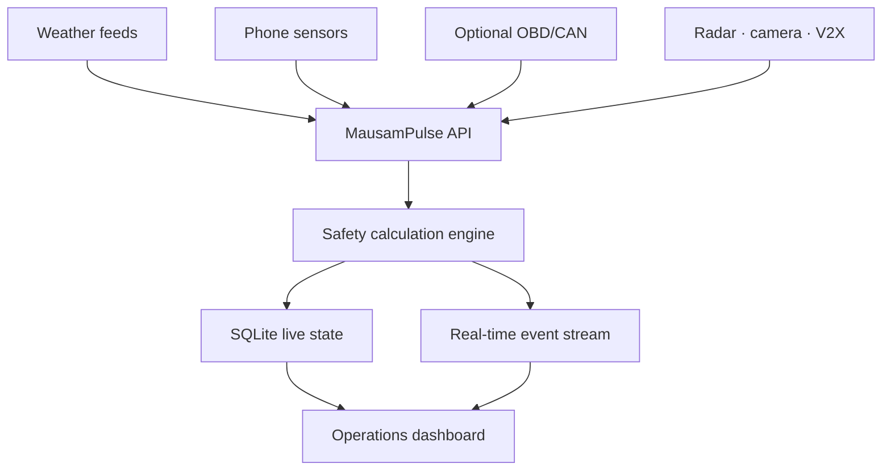
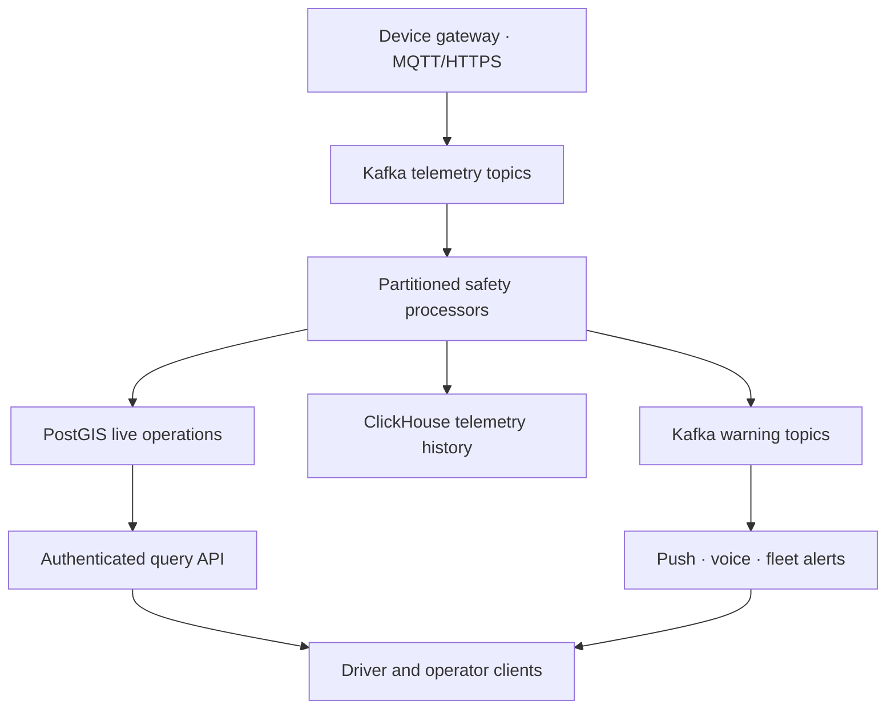

# Architecture

## Standalone MVP

The API validates sensor claims before calculation. A brake-pressure percentage is accepted only when the payload declares an OBD/CAN or simulated OBD/CAN source. Lead distance and lead speed must arrive together before time-to-collision is calculated.

## Processing sequence

1. Authenticate the device/operator request.
2. Confirm that the vehicle belongs to the reporting user.
3. Validate coordinates, timestamps, speed, visibility, and sensor ranges.
4. Load the vehicle's previous sample.
5. Calculate collision TTC, braking/deceleration, stop-line state, and visibility guidance.
6. Match active weather-alert geofences.
7. Score any pothole IMU/camera evidence and cluster it spatially.
8. Save raw input separately from assessments.
9. Emit safety and dashboard events through Server-Sent Events.
10. Apply consent rules before returning live identities or positions.

## Scale-out target

Partition telemetry by stable `vehicle_id` so consecutive speed samples reach the same processor. Keep raw measurements, derived assessments, source identity, model/version, and analyst actions separately auditable.

## Suggested event topics

| Topic | Payload |
|---|---|
| `vehicle.telemetry.raw` | Signed device sensor envelope |
| `weather.alerts.canonical` | Geofenced official and trusted alerts |
| `road.safety.assessments` | TTC, visibility, braking, and signal decisions |
| `road.safety.alerts` | High-priority driver/operator notifications |
| `road.hazards.evidence` | Pothole and obstruction evidence |
| `road.hazards.canonical` | Clustered, confidence-scored road hazards |
| `road.safety.dead-letter` | Invalid input plus validation reason |

## Latency targets to validate

Targets are not guarantees until tested on chosen hardware and networks.

| Flow | Initial engineering target |
|---|---|
| Sensor-to-assessment | p95 below 1 second |
| Assessment-to-visible warning | p95 below 2 seconds |
| Vehicle position refresh | 1–2 Hz for the MVP; higher only when justified |
| Weather-feed update | Source cadence plus less than 30 seconds internal delay |
| Pothole clustering | Below 5 seconds after evidence arrival |

Automatic actuation demands a separate certified, in-vehicle real-time path; a cloud API is not suitable for emergency braking control.
